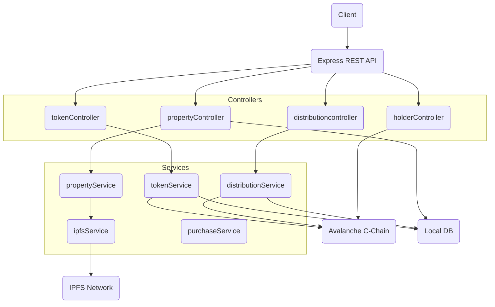
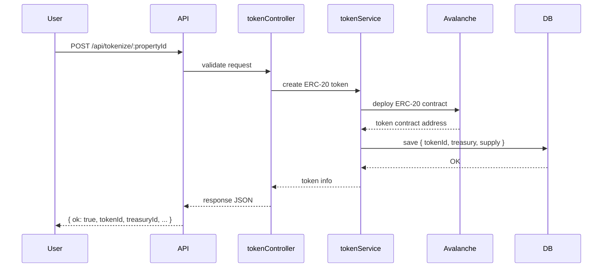

# Avalanche IPFS Property Tokenization Backend (MVP)

This backend provides a complete workflow for real-estate asset tokenization using:

- **Avalanche C-Chain (EVM)**
- **ERC-20 token deployment for fractional ownership**
- **IPFS for off-chain property media + metadata**
- **Local DB (LowDB/SQLite) for property + token state**
- **Express.js REST API**

---

# Project Structure

```

backend/
├── src/
│   ├── app.js                      # Express app entry
│   ├── server.js                   # Starts the server
│   │
│   ├── config/
│   │   ├── avalancheClient.js      # Avalanche RPC + ethers provider/wallet
│   │   ├── ipfsClient.js           # IPFS/Pinata client setup
│   │   ├── env.js                  # Load environment variables
│   │   └── logger.js               # Logging configuration
│   │
│   ├── controllers/
│   │   ├── propertyController.js   # Upload, list, detail
│   │   ├── tokenController.js      # ERC-20 token creation
│   │   ├── purchaseController.js   # Simulated token transfers
│   │   ├── auditController.js      # Token lookup + tx history (frontend-simulated)
│   │   ├── holderController.js     # Ownership verification (ERC-20 balanceOf)
│   │   ├── distributionController.js # Rental income prototype
│   │   └── adminController.js      # Error logs and observability
│   │
│   ├── models/
│   │   ├── propertyModel.js        # Metadata schema & local DB
│   │   ├── tokenModel.js           # Token contract info + treasury
│   │   ├── saleModel.js            # Purchase / token transfer history
│   │   ├── distributionModel.js    # Rental distribution records
│   │   └── logModel.js             # Local error logs
│   │
│   ├── routes/
│   │   ├── propertyRoutes.js       # /api/properties/*
│   │   ├── tokenRoutes.js          # /api/tokenize, /api/buy
│   │   ├── auditRoutes.js          # /api/audit
│   │   ├── holderRoutes.js         # /api/holders
│   │   ├── distributionRoutes.js   # /api/distribute
│   │   └── adminRoutes.js          # /api/admin
│   │
│   ├── services/
│   │   ├── propertyService.js      # Metadata creation + hashing
│   │   ├── ipfsService.js          # IPFS upload + content verification
│   │   ├── tokenService.js         # ERC-20 token deployment (Avalanche)
│   │   ├── purchaseService.js      # Token transfers (ERC-20)
│   │   ├── distributionService.js  # Rental income logic
│   │   └── cacheService.js         # Redis/In-memory caching
│   │
│   ├── utils/
│   │   ├── hashUtil.js             # SHA-256 Hashing
│   │   ├── validateUtil.js         # Payload validators
│   │   ├── responseUtil.js         # Standardized API responses
│   │   ├── errorUtil.js            # Error formatting
│   │   └── constants.js            # App constants
│   │
│   ├── middlewares/
│   │   ├── errorHandler.js         # Global error handler
│   │   ├── requestLogger.js        # Log incoming requests
│   │   └── validateRequest.js      # Joi/Schema validation
│   │
│   ├── db/
│   │   ├── index.js                # DB initialization
│   │   └── seed.js                 # Demo properties
│   │
│   ├── tests/
│   │   ├── unit/
│   │   ├── integration/
│   │   └── testConfig.js
│   │
│   ├── logs/
│   │   ├── app.log
│   │   ├── avalanche.log
│   │
│   └── index.js                    # Fallback entry
│
├── .env.example
├── package.json
├── README.md
├── runbook.md
├── openapi.yaml
└── scripts/
├── start.sh
└── verifyContract.sh

```

---

# Features

### ✔ IPFS Integration  
- Upload property images & documents  
- Generate canonical metadata JSON  
- Upload metadata to IPFS → receive CID  
- Store `{ id, metadataCid, canonicalHash }`

---

### ✔ Avalanche Tokenization  
Each property can be tokenized by deploying a **new ERC-20 smart contract**:

- Auto-generated treasury wallet  
- ERC-20 token name/symbol per property  
- Fixed or variable supply  
- Transfers using ethers.js  
- Persist token contract info locally

---

### ✔ Ownership & Distribution  
- Query ERC-20 balances  
- Simulate property sales via transfer  
- Simulate rental income distribution  
- Query history (local logs)

---

# API Endpoints

### **Properties**
| Method | Endpoint | Description |
|--------|-----------|-------------|
| POST | `/api/properties` | Upload media + metadata |
| GET | `/api/properties` | List all properties |
| GET | `/api/properties/:id` | Get single property |

### **Tokenization**
| Method | Endpoint | Description |
|--------|-----------|-------------|
| POST | `/api/tokenize/:propertyId` | Deploy ERC-20 token |
| POST | `/api/buy/:propertyId` | Simulated transfer |

### **Ownership**
| GET | `/api/holders/:tokenId/:address` | ERC-20 balanceOf |

---

# How to Run

1. Copy `.env.example` → `.env`
2. Add:  
```

AVALANCHE_RPC_URL=
OPERATOR_PRIVATE_KEY=

```
3. Install dependencies:
```

npm install

```
4. Start backend:
```

npm start

```

---

# UML Architecture (Mermaid)

## **System Architecture Overview**



---

## **Tokenization Sequence Diagram**



---

# Output Example (After Token Creation)

```json
{
  "ok": true,
  "property": {
    "id": "prop123",
    "treasuryId": "0x9A77...",
    "treasuryKey": "0xabcdef123...",
    "tokenId": "0xA3F1eE749EafB0d8F1c67CDA7e03A96ab12E1a92",
    "tokenInitialSupply": 10000,
    "tokenCreatedAt": "2025-02-10T18:25:43.511Z"
  }
}
```